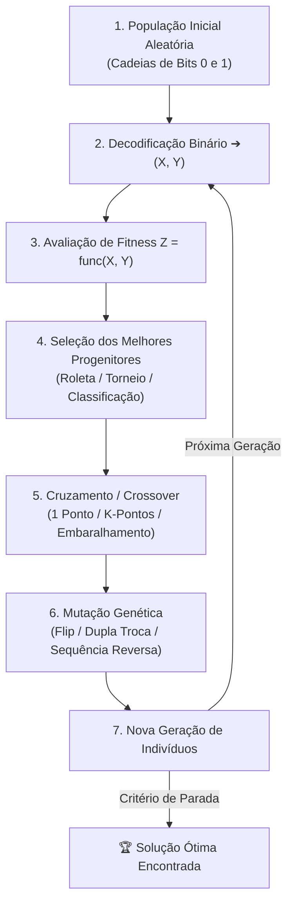

# 🧬 PyGenec — Algoritmo Genético em Python

Uma biblioteca modular e didática em Python para **Algoritmos Genéticos (AG) e Otimização Evolucionária**, com representação cromossômica binária e visualização tridimensional em tempo real.

---

## 📌 Sumário
- [Sobre o Projeto](#-sobre-o-projeto)
- [Como Funciona o Algoritmo](#-como-funciona-o-algoritmo)
  - [1. Representação Genética (Genótipo $\to$ Fenótipo)](#1-representação-genética-genótipo-to-fenótipo)
  - [2. Superfície de Teste (Função Peaks)](#2-superfície-de-teste-função-peaks)
  - [3. O Ciclo Evolutivo](#3-o-ciclo-evolutivo)
- [Estrutura dos Módulos](#-estrutura-dos-módulos)
  - [Seleção](#-módulo-de-seleção-pygenecselecao)
  - [Cruzamento (Crossover)](#-módulo-de-cruzamento-pygeneccruzamento)
  - [Mutação](#-módulo-de-mutação-pygenecmutacao)
  - [Evolução](#-orquestrador-de-evolução-pygenecevolucaopy)
- [Como Executar](#-como-executar)
- [Exemplo de Saída no Terminal](#-exemplo-de-saída-no-terminal)

---

## 📖 Sobre o Projeto

O **PyGenec** simula a seleção natural e a genética darwiniana para encontrar os pontos ótimos (máximos ou mínimos) em funções matemáticas complexas e superfícies multidimensionais.

Os indivíduos da população são representados por cadeias de bits (0s e 1s). Ao longo das gerações, os indivíduos mais aptos transmitem seus genes aos descendentes através de cruzamento e mutação, fazendo a população convergir para o topo global da função.

---

## ⚙️ Como Funciona o Algoritmo



### 1. Representação Genética (Genótipo $\to$ Fenótipo)
Cada indivíduo possui um cromossomo binário de $N$ bits (ex: 32 bits).
* **Primeira Metade (16 bits):** Codifica a coordenada $X$ no intervalo $[-3, +3]$.
* **Segunda Metade (16 bits):** Codifica a coordenada $Y$ no intervalo $[-3, +3]$.

A função `xy()` converte o valor binário para um número inteiro e aplica a escala linear:
$$\text{coordenada} = n_{\min} + \left(\frac{n_{\max} - n_{\min}}{2^{\text{bits}} - 1}\right) \times \text{inteiro}$$

### 2. Superfície de Teste (Função Peaks)
A função objetivo utilizada como paisagem de aptidão (*fitness landscape*) é a clássica **Função Peaks**:
$$z = 3(1-x)^2 e^{-(x^2 + (y+1)^2)} - \frac{1}{3} e^{-((x+1)^2 + y^2)} + (10x^3 - 2x + 10y^5) e^{-(x^2 + y^2)}$$

O objetivo do algoritmo é encontrar as coordenadas $(X, Y)$ que maximizam $Z$ ($Z \approx 8.106$).

---

## 📂 Estrutura dos Módulos

```text
pygenec/
├── __init__.py
├── populacao.py            # Criação e avaliação da população inicial
├── evolucao.py             # Orquestrador do laço evolutivo e elitismo
├── selecao/                # Operadores de Seleção
│   ├── selecao.py          # Classe base abstrata
│   ├── roleta.py           # Seleção proporcional ao fitness (Roleta)
│   ├── torneio.py          # Seleção por disputa em grupos (Torneio)
│   └── classificacao.py    # Seleção por ranking linear
├── cruzamento/             # Operadores de Reprodução (Crossover)
│   ├── cruzamento.py       # Classe base abstrata
│   ├── umponto.py          # Crossover de 1 ponto de corte
│   ├── kpontos.py          # Crossover de K pontos de corte
│   └── embaralhamento.py   # Crossover com embaralhamento prévio
└── mutacao/                # Operadores de Mutação
    ├── mutacao.py          # Classe base abstrata
    ├── flip.py             # Inversão de bit aleatório (0 ↔ 1)
    ├── duplatroca.py       # Troca de posição entre 2 genes
    └── sequenciareversa.py # Inversão de uma sequência de genes
```

### 🎯 Módulo de Seleção (`pygenec.selecao`)
* **`Roleta`**: A probabilidade de um indivíduo ser escolhido é diretamente proporcional à sua aptidão ($Z$).
* **`Torneio`**: Sorteia um grupo aleatório de indivíduos e seleciona o campeão (maior fitness) do grupo.
* **`Classificacao`**: Ordena os indivíduos por ranking para evitar que um único indivíduo super-apto domine a roleta prematuramente.

### 🧬 Módulo de Cruzamento (`pygenec.cruzamento`)
* **`UmPonto`**: Corta os cromossomos de dois pais em 1 ponto aleatório e troca as metades.
* **`KPontos`**: Sorteia múltiplos pontos de corte e alterna os segmentos entre os pais.
* **`Embaralhamento`**: Embaralha a ordem dos genes, aplica o corte de 1 ponto e desfaz o embaralhamento.

### 🎲 Módulo de Mutação (`pygenec.mutacao`)
* **`Flip`**: Inverte o bit ($0 \to 1$ ou $1 \to 0$) em posições sorteadas com base na taxa `pmut`.
* **`DuplaTroca`**: Escolhe dois genes dentro do cromossomo e troca suas posições.
* **`SequenciaReversa`**: Sorteia um intervalo de genes e inverte a ordem desse segmento.

### 🔄 Orquestrador de Evolução (`pygenec.evolucao.py`)
A classe `Evoluacao` coordena cada geração:
1. Avalia o fitness da população atual.
2. Preserva o melhor indivíduo absoluto da geração (**Elitismo**).
3. Seleciona os progenitores (`nsele`).
4. Realiza o cruzamento com probabilidade `ncruz`.
5. Aplica mutação com probabilidade `pmut`.
6. Monta a nova população para a próxima geração.

---

## 🚀 Como Executar

### Pré-requisitos
Certifique-se de ter o Python 3.8+ e as dependências instaladas:
```bash
pip install numpy matplotlib
```

### Executando a Simulação
Execute o arquivo principal:
```bash
python3 main.py
```

Uma janela gráfica 3D será aberta exibindo a **animação em tempo real** dos indivíduos (pontos vermelhos) subindo a montanha até convergirem para o topo.

---

## 📊 Exemplo de Saída no Terminal

Durante e após a execução, o terminal exibe o progresso das gerações, uma tabela de cruzamento e o resumo da melhor solução:

```text
===========================================================================
  GERAÇÃO   |   MELHOR X   |   MELHOR Y   |   MELHOR FITNESS (Z)  |  STATUS
===========================================================================
  Gen    1  |     0.6584   |     1.5920   |          5.3347       | 🚀 Subindo
  Gen    5  |     0.4753   |     1.7542   |          6.1105       | 🚀 Subindo
  Gen   10  |     0.0190   |     1.7883   |          7.4623       | 🚀 Subindo
  Gen   20  |     0.0219   |     1.6006   |          8.0926       | 🏆 No Topo!
===========================================================================

==================================================================================
                      🧬 TABELA DE CRUZAMENTO (CROSSOVER)
==================================================================================
 Indivíduo  | Genes (Cromossomo)                 | X       | Y       | Fitness (Z)
----------------------------------------------------------------------------------
 Pai 1      | 11110111001000010101001000100011   | 0.116   | 1.601   | 7.9767     
 Pai 2      | 11110001000000010001001000100011   | 0.013   | 1.600   | 8.0965     
----------------------------------------------------------------------------------
 Filho 1    | 11110011001000010101001000100011   | 0.113   | 1.601   | 7.9824     
 Filho 2    | 11110101000000010001001000100011   | 0.016   | 1.600   | 8.0954     
==================================================================================

==================================================
           🏆 MELHOR SOLUÇÃO ENCONTRADA
==================================================
Gerações executadas : 50
Coordenada X        : 0.013125
Coordenada Y        : 1.600412
Valor Máximo (Z)    : 8.096531
Cromossomo Binário  : 11110001000000010001001000100011
==================================================
```
